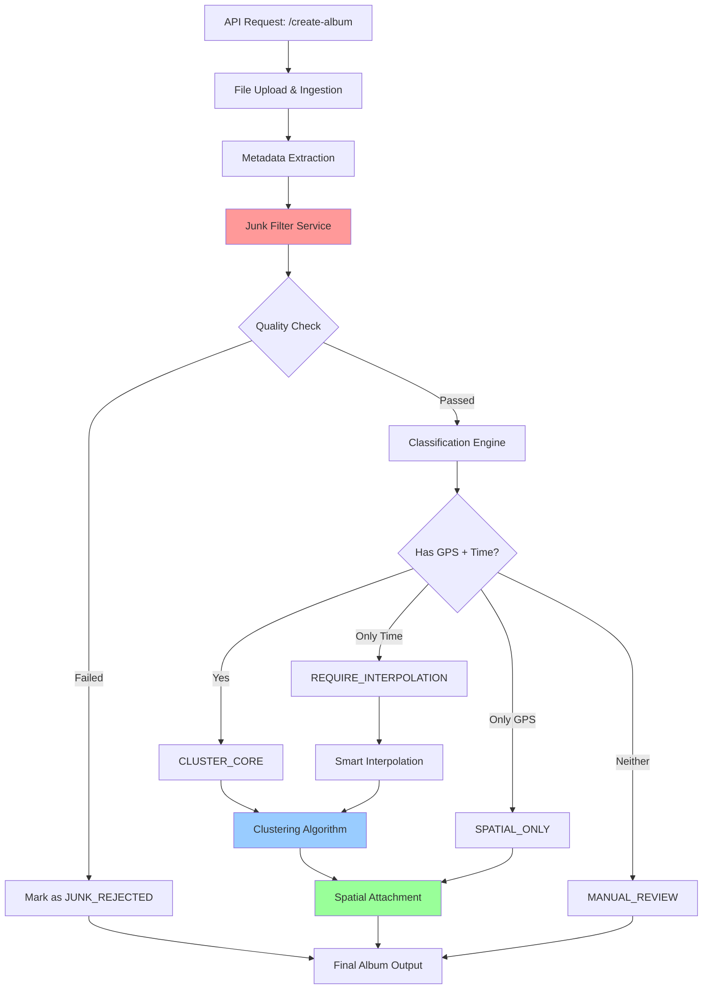

# Comprehensive Pipeline Analysis: Photo Album Auto-Organization System

## 1. High-Level Architecture

### What This Pipeline Achieves
This is an **intelligent photo clustering and album creation system** that automatically organizes photos into meaningful groups (albums/events) based on spatio-temporal metadata. It handles real-world challenges like missing GPS data, unreliable timestamps, and junk photos through a multi-stage pipeline.

**Core Value Proposition:** Transform a messy collection of photos into semantically organized albums without manual sorting.

---

### Execution Flow Diagram


---

## 2. File-by-File Breakdown

### **main.py** - Orchestration Layer
**Responsibility:** FastAPI application entry point; orchestrates the entire pipeline.

**Key Components:**
- `get_clustering_strategy()` - Factory pattern for algorithm selection
- `/create-album` endpoint - Main API handler
- Temporary file management with cleanup

**Dependencies:**
- `schemas.py` - Data models
- `metadata_service.py` - EXIF extraction and interpolation
- `junk_filter_service.py` - Quality filtering
- `clustering_service.py` - Algorithm implementations

**Critical Logic:**
```python
# Pipeline sequence (lines 60-96):
1. Ingest files → temp storage
2. Extract metadata → PhotoObject instances
3. Filter junk → separate good/bad
4. Interpolation → fix missing GPS
5. Clustering → group by location/time
6. Spatial attachment → recover "ghost" photos
```

---

### **schemas.py** - Data Contract
**Responsibility:** Defines the data model and processing states.

**Key Enums/Classes:**
- `ProcessingDirective` - State machine for photo classification:
  - `CLUSTER_CORE` - Ready for clustering (has GPS + time)
  - `REQUIRE_INTERPOLATION` - Missing GPS, can be fixed
  - `SPATIAL_ONLY` - Has GPS, unreliable time
  - `MANUAL_REVIEW` - Insufficient metadata
  - `JUNK_REJECTED` - Failed quality checks

- `PhotoObject` - Central data structure carrying:
  - Identifiers (ID, filename, path)
  - Metadata (timestamp, GPS coordinates)
  - Processing state (directive, cluster assignment)
  - Filter results (lighting, ML scores)

**Dependencies:** None (pure data models)

---

### **metadata_service.py** - Intelligence Core
**Responsibility:** EXIF parsing, smart interpolation, and spatial attachment logic.

**Key Functions:**

1. **`extract_single_image_metadata()`** (Lines 82-132)
   - Reads EXIF tags via `exifread`
   - Fallback hierarchy: EXIF time → Filename parsing → File modification time
   - Assigns initial `ProcessingDirective` based on metadata completeness

2. **`interpolation()`** (Lines 137-205)
   - **THE SMART PART:** Fills GPS gaps using velocity-based heuristics
   - Rules:
     - < 15 min gaps: Always safe to interpolate
     - Stationary (< 1 km/h): Safe up to 4 hours (restaurant/museum)
     - Moving: Only if < 30 min (prevents "cutting corners")
     - Flights (> 100 km/h): Ignored
   - Uses haversine distance for accuracy

3. **`spatial_attachment()`** (Lines 207-274)
   - Attaches "ghost photos" (GPS, no time) to existing clusters
   - Dynamic reach calculation: `max(200m, 3 × std_dev)`
   - Statistical clustering confidence (99% normal distribution)

**Helper Functions:**
- `parse_date_from_filename()` - Regex-based date extraction (YYYY-MM-DD, DD-MM-YYYY)
- `parse_timestamp()` - EXIF tag priority list
- `dms_to_decimal()` - GPS coordinate conversion
- `haversine_distance()` - Spherical distance calculation

**Dependencies:**
- `exifread` - EXIF parsing
- `numpy` - Statistical calculations
- `schemas.py` - Data models

---

### **clustering_service.py** - Algorithm Layer
**Responsibility:** Abstract clustering interface with 3 concrete implementations.

**Architecture Pattern:** Strategy Pattern
```python
ClusteringService (ABC)
├── DBSCAN - Pure spatial clustering
├── STDBSCAN - Spatial + temporal splitting
└── STHDBSCAN - Density-based + temporal splitting
```

**Key Implementations:**

1. **`DBSCAN`** (Lines 64-88)
   - Pure spatial clustering using haversine metric
   - Auto-tuning via K-Distance method (90th percentile)
   - Safety clamps: 20m - 2km

2. **`STDBSCAN`** (Lines 140-198)
   - "Filter & Refine" approach:
     1. Run spatial DBSCAN
     2. Split clusters by time gaps (default: 2 hours)
   - Best for trips with distinct temporal phases

3. **`STHDBSCAN`** (Lines 93-135)
   - Uses HDBSCAN for variable-density clustering
   - Auto-scaling: `min_cluster_size = max(3, N × 0.015)`
   - Time-based splitting post-clustering

**Shared Logic:**
- `_get_core_coords()` - Filters photos ready for clustering
- `_calculate_dynamic_eps()` - K-nearest neighbor optimization

**Dependencies:**
- `sklearn.cluster.DBSCAN` - Spatial clustering
- `hdbscan` - Hierarchical density-based clustering
- `pandas` - Time-diff calculations
- `numpy` - Coordinate transformations

---

### **junk_filter_service.py** - Quality Gate
**Responsibility:** Two-stage filtering to reject low-quality photos.

**Architecture:**
```python
JunkFilterService
├── LightingFilter (rule-based)
└── ML Model (optional, TensorFlow)
```

**Filtering Logic:**
1. **Lighting Check** (Lines 28-31)
   - Delegates to `LightingFilter.analyze_image()`
   - Pass/fail + human-readable reason

2. **ML Check** (Lines 33-51)
   - Loads pre-trained Keras model (`junk_filter_model_v3.h5`)
   - Input: 224×224 RGB images
   - Output: Junk probability (0-1 scale)
   - Graceful degradation if model missing

3. **Final Verdict** (Lines 53-73)
   - Reject if: `lighting_fails OR ml_is_junk`
   - Updates `clustering_directive` to `JUNK_REJECTED`

**Dependencies:**
- `tensorflow.keras` - ML model inference
- `lighting_filter.py` - Rule-based checks
- `schemas.py` - Data models

---

### **lighting_filter.py** - Rule-Based Checker
**Responsibility:** Detects underexposed, overexposed, and glare-affected photos.

**Thresholds (Lines 7-16):**
```python
MIN_BRIGHTNESS = 40.0    # Below = too dark
MAX_BRIGHTNESS = 220.0   # Above = overexposed
GLARE_RATIO = 0.30       # 30% burned pixels = rejected
```

**Detection Method (Lines 18-46):**
1. Convert BGR → HSV color space
2. Extract V (Value) channel - brightness
3. Calculate mean brightness
4. Count pixels > 250 (glare detection)
5. Return verdict: `(is_good, reason, score)`

**Why HSV?** More perceptually accurate than grayscale for brightness analysis.

**Dependencies:**
- `opencv-cv2` - Image processing
- `numpy` - Array operations

---

## 3. The Data Flow (Critical Path)

### Input Stage
```
HTTP POST /create-album
└── files: List[UploadFile]  (multipart/form-data)
└── algorithm: str = "st-hdbscan"
└── Optional params: eps_km, time_gap_minutes, etc.
```

### Transformation Pipeline

#### **Stage 1: Ingestion** (main.py, lines 60-74)
```python
UploadFile → NamedTemporaryFile → PhotoObject
```
- Preserves original filename
- Extracts file extension for temp file
- Creates `PhotoObject` with UUID

#### **Stage 2: Metadata Extraction** (metadata_service.py, line 96)
```python
PhotoObject + EXIF tags → Enriched PhotoObject
```
**Outputs:**
- `timestamp_utc` (EXIF > filename > file_mtime)
- `gps_coordinates` (DMS → decimal degrees)
- `clustering_directive` (initial classification)

#### **Stage 3: Quality Filtering** (junk_filter_service.py, line 75)
```python
PhotoObject → lighting_check() → ml_check() → verdict
```
**Branching:**
- ✅ Pass → Keep original directive
- ❌ Fail → Override to `JUNK_REJECTED`

#### **Stage 4: Data Separation** (main.py, lines 77-80)
```python
all_photos → good_photos (clusterable)
           → rejected_photos (sent to output as-is)
```

#### **Stage 5: Interpolation** (metadata_service.py, line 169)
```python
REQUIRE_INTERPOLATION photos → GPS calculation → CLUSTER_CORE
```
**Algorithm:**
```python
velocity = distance / time_gap
if (gap < 15min) OR 
   (stationary AND gap < 4h) OR 
   (moving AND gap < 30min):
    new_gps = linear_interpolation(prev, next, fraction)
```

#### **Stage 6: Clustering** (clustering_service.py, line 66/95/142)
```python
CLUSTER_CORE photos → Algorithm.cluster() → assigned_cluster_id
```
**Outputs:** Unique cluster IDs like:
- `DBSCAN_a1b2c3d4_0`
- `ST-HDBSCAN_e5f6g7h8_2_1` (spatial_temporal)

#### **Stage 7: Spatial Attachment** (metadata_service.py, line 251)
```python
SPATIAL_ONLY photos → Cluster centroids → Nearest match
```
**Logic:**
```python
for each ghost_photo:
    for each cluster:
        if distance < cluster.dynamic_reach:
            assign to cluster
```

### Output Stage
```python
return List[PhotoObject]  # JSON response
└── good_photos (clustered)
└── rejected_photos (with reasons)
```

**Response Example:**
```json
[
  {
    "image_id": "uuid-1234",
    "original_filename": "IMG_5678.jpg",
    "timestamp_utc": "2025-11-19T14:30:00Z",
    "gps_coordinates": {"lat": 10.762622, "lon": 106.660172},
    "assigned_cluster_id": "ST-HDBSCAN_abc123_0_0",
    "clustering_directive": "CLUSTER_CORE",
    "is_junk": false
  }
]
```

---

## 4. Execution Logic & Configuration

### Triggering Mechanisms

**1. API Invocation (Production)**
```bash
curl -X POST "http://127.0.0.1:8000/create-album" \
  -F "files=@photo1.jpg" \
  -F "files=@photo2.jpg" \
  -F "algorithm=st-hdbscan" \
  -F "time_gap_minutes=120"
```

**2. Direct Execution (Development)**
```bash
uvicorn main:app --host 127.0.0.1 --port 8000
```
- Entry point: `if __name__ == "__main__"` (line 134)

### Configuration Points

**No External Config Files** - Everything is parameterized through:

1. **API Query Parameters** (main.py, lines 52-58)
```python
   algorithm: Enum["dbscan", "st-hdbscan", "st-dbscan"]
   eps_km: Optional[float] = None  # Auto if not set
   time_gap_minutes: int = 120
   min_cluster_size: Optional[int] = None  # HDBSCAN
   min_samples: Optional[int] = None
```

2. **Hard-Coded Constants** (clustering_service.py, lines 15-18)
```python
   EARTH_RADIUS_KM = 6371.0088
   DEFAULT_EPS_M = 50
   MIN_EPS_KM = 0.02  # 20m minimum
   MAX_EPS_KM = 2.0   # 2km maximum
```

3. **Lighting Thresholds** (lighting_filter.py, lines 7-16)
```python
   MIN_BRIGHTNESS = 40.0
   MAX_BRIGHTNESS = 220.0
   GLARE_RATIO_THRESHOLD = 0.30
```

### Factory Pattern Details
```python
def get_clustering_strategy(algorithm_name: str, **kwargs):
    if algorithm_name == "st-hdbscan":
        return STHDBSCAN(...)
    elif algorithm_name == "st-dbscan":
        return STDBSCAN(...)
    else:
        return DBSCAN(...)  # Default
```
**Benefits:**
- Runtime algorithm switching
- Isolated testing of strategies
- Easy to add new algorithms

---

## 5. Potential Pain Points & Recommendations

### 🔴 Critical Issues

**1. Memory Explosion Risk** (main.py, lines 60-74)
```python
# Loads ALL files into temp storage before processing
for file in files:
    shutil.copyfileobj(file.file, temp_file)  # Blocking I/O
    all_photos.append(...)
```
**Problem:** 10,000 photos × 5MB = 50GB RAM consumption  
**Solution:** Stream processing with batch limits:
```python
MAX_BATCH_SIZE = 500
if len(files) > MAX_BATCH_SIZE:
    raise ValueError("Batch size exceeded")
```

**2. Missing Input Validation** (main.py, line 52)
```python
files: List[UploadFile] = File(...)  # No file type check
```
**Risk:** Someone uploads a 4GB video or malicious file  
**Solution:**
```python
ALLOWED_EXTENSIONS = {'.jpg', '.jpeg', '.png', '.heic'}
MAX_FILE_SIZE_MB = 50

for file in files:
    ext = os.path.splitext(file.filename)[1].lower()
    if ext not in ALLOWED_EXTENSIONS:
        raise ValueError(f"Invalid file type: {ext}")
```

---

### ⚠️ Architectural Concerns

**3. Tight Coupling to File System** (schemas.py, line 37)
```python
temp_file_path: str  # Hard-coded in PhotoObject
```
**Problem:** Can't scale to S3/cloud storage  
**Solution:** Abstract storage layer:
```python
class StorageProvider(ABC):
    @abstractmethod
    def read_image(self, path: str) -> bytes
```

**4. Synchronous ML Inference** (junk_filter_service.py, line 45)
```python
prediction = self.model.predict(img_array, verbose=0)
```
**Problem:** Blocks API thread for 50-200ms per image  
**Solution:** Async worker queue (Celery/RQ) or batch inference

**5. No Database Persistence**
**Problem:** Results lost after API response  
**Missing:**
- Cluster metadata (names, locations, date ranges)
- User sessions (re-clustering, undo operations)
- ML model versioning

---

### 🟡 Code Quality Issues

**6. Inconsistent Error Handling**
```python
# metadata_service.py, line 129
except Exception as e:
    print(f"Error: {e}")  # Too generic
    photo.clustering_directive = ProcessingDirective.MANUAL_REVIEW
```
**Problems:**
- Swallows exceptions silently
- No logging infrastructure (use `logging` module)
- No error metrics/alerts

**7. Magic Numbers Everywhere**
```python
# interpolation() - line 169
if time_gap_seconds < (15 * 60):  # What's special about 15?
if velocity < 1.0 and time_gap_seconds < (4 * 60 * 60):  # Why 4 hours?
```
**Solution:** Named constants with docstrings:
```python
INTERPOLATION_SHORT_GAP_MINUTES = 15  # Safe for any scenario
INTERPOLATION_STATIONARY_MAX_HOURS = 4  # Museums, restaurants
INTERPOLATION_STATIONARY_SPEED_KMH = 1.0  # Threshold for movement
```

**8. Hardcoded Vietnamese Text** (lighting_filter.py, line 46)
```python
return False, "Quá tối (Underexposed)", mean_brightness
```
**Problem:** Breaks internationalization  
**Solution:** i18n framework or message enums

---

### 🟢 Performance Optimizations

**9. Inefficient Distance Calculations** (metadata_service.py, line 253)
```python
for ghost in ghosts:
    for cluster_id, stats in cluster_stats.items():
        dist = haversine_distance(...)  # O(n²)
```
**Solution:** Spatial indexing (KD-tree, R-tree):
```python
from scipy.spatial import cKDTree
tree = cKDTree(cluster_centroids)
distances, indices = tree.query(ghost_coords, k=5)
```

**10. Redundant File Reads** (junk_filter_service.py)
```python
self._check_lighting(photo.temp_file_path)  # Reads file
self._check_ml(photo.temp_file_path)        # Reads again
```
**Solution:** Load once, pass numpy array

---

### 🔵 Maintenance & Scalability

**11. No Unit Tests**
**Missing:**
- Fixtures for sample EXIF data
- Edge case tests (e.g., photos at date line)
- Mock tests for ML model

**12. Configuration Sprawl**
**Problem:** 8+ parameters in API call, unclear defaults  
**Solution:** Configuration profiles:
```python
PRESETS = {
    "city_walk": {"algorithm": "st-hdbscan", "time_gap_minutes": 60},
    "road_trip": {"algorithm": "st-dbscan", "eps_km": 0.5},
    "vacation": {"algorithm": "st-hdbscan", "time_gap_minutes": 180}
}
```

**13. Observability Gap**
- No request tracing (add `correlation_id`)
- No performance metrics (clustering time, interpolation success rate)
- No business metrics (avg cluster size, junk filter precision)

---

## Summary Recommendations

### Immediate Actions (Next Sprint)
1. Add input validation (file types, size limits)
2. Implement proper logging (`structlog` or `loguru`)
3. Add database layer (PostgreSQL + SQLAlchemy)
4. Write integration tests for happy path

### Short-Term (1-2 Months)
1. Async processing queue for ML inference
2. Spatial indexing for ghost photo attachment
3. Configuration management (Pydantic Settings)
4. Monitoring dashboard (Prometheus + Grafana)

### Long-Term (Roadmap)
1. Microservices split (clustering service, ML service)
2. Cloud storage adapter (S3/GCS)
3. Real-time clustering updates (WebSocket)
4. Advanced ML models (semantic photo similarity)

---

This pipeline is architecturally sound for an MVP but needs production hardening. The interpolation logic is particularly clever, and the strategy pattern for clustering provides good extensibility. Focus on error handling and observability before scaling.