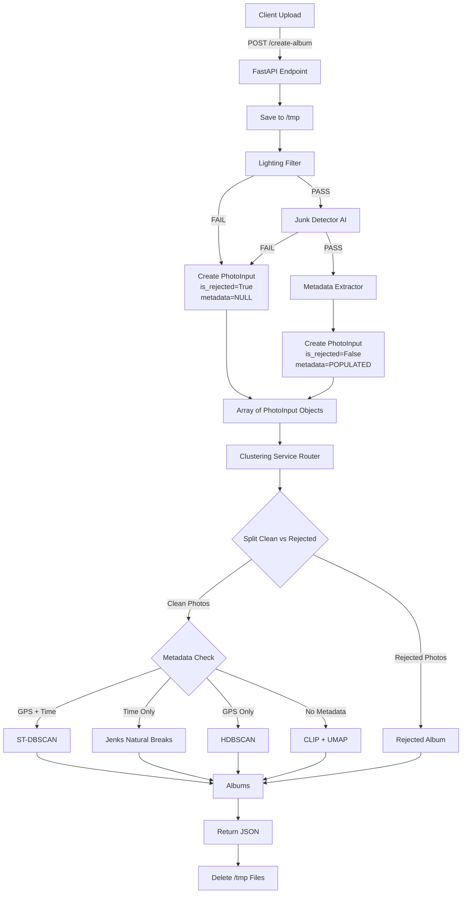

# Smart Photo Album Pipeline

## 1. High-Level Architecture

### What This Pipeline Achieves
This is a **stateless, intelligent photo album generation service** that:
- Accepts batch photo uploads via REST API
- Filters out low-quality images (poor lighting, junk/screenshots)
- Extracts metadata (GPS, timestamps) from EXIF data
- Intelligently clusters photos into thematic albums using 4-tier adaptive logic
- Returns organized albums without persisting any data

### System Flow Diagram



---

## 2. File-by-File Breakdown

### **main.py** - API Gateway & Orchestrator
**Role:** FastAPI application entry point; coordinates the entire pipeline

**Key Functions:**
- `create_album()` - Main endpoint that orchestrates upload → filter → cluster → cleanup

**Dependencies:**
- `MetadataExtractor` (metadata.py)
- `LightingFilter` (filters/lighting.py)
- `is_junk()` (filters/junk_detector.py)
- `ClusteringService` (clustering/service.py)

**Critical Logic:**
```python
# Sequential processing per photo:
1. Stream upload to /tmp (preserves RAM)
2. Lighting check → reject if bad
3. Junk AI check → reject if screenshot/document
4. Extract EXIF metadata
5. Build PhotoInput objects
6. Run clustering on all photos
7. Finally block ensures /tmp cleanup
```

---

### **metadata.py** - EXIF Data Extraction
**Role:** Extracts GPS coordinates and timestamps from photo metadata

**Key Functions:**
- `get_metadata()` - Reads EXIF tags (36867=DateTime, 34853=GPS)
- `_parse_gps()` - Converts DMS (degrees/minutes/seconds) to decimal

**Dependencies:**
- PIL (with HEIC support via pillow_heif)

**Pain Points:**
- Silent failure on corrupt EXIF (returns null values)
- GPS parsing assumes specific EXIF structure (could break on non-standard formats)

---

### **schemas.py** - Data Contracts
**Role:** Pydantic models defining data structures

**Key Classes:**
- `PhotoInput` - Pre-clustering data (includes path, metadata, rejection status)
- `PhotoOutput` - Post-clustering data (sanitized, no local_path exposed to client)
- `Album` - Final output structure

**Note:** Clean separation of internal vs. external data models

---

### **config.py** - Environment Setup
**Role:** Creates temporary directory for uploads

**Behavior:**
- Uses system temp dir (`/tmp` on Linux/Mac, `%TEMP%` on Windows)
- Creates subfolder `smart-album-uploads/` for isolation

---

### **logger_config.py** - Logging Infrastructure
**Role:** Centralized logger with stdout streaming (Vercel-compatible)

**Config:**
- Level: INFO
- Handler: Console (visible in cloud dashboards)

---

### **junk_detector.py** - AI Quality Filter
**Role:** TensorFlow binary classifier to detect screenshots/documents/receipts

**Key Functions:**
- `get_model()` - Singleton loader for `junk_filter_model_v3.h5`
- `is_junk()` - Preprocesses image (224×224) and runs inference

**Critical Assumption:**
```python
# Model interpretation (VERIFY WITH TEAMMATE!)
is_junk_detected = prediction < 0.5
# Could be reversed! Test with known junk image
```

**Pain Points:**
- Model path hardcoded (`models/junk_filter_model_v3.h5`)
- Fails gracefully (returns False) if model missing
- No GPU acceleration configured

---

### **lighting.py** - Rule-Based Image Quality Filter
**Role:** Fast heuristic checks for exposure and glare

**Key Thresholds:**
- `MIN_BRIGHTNESS = 40` (rejects underexposed)
- `MAX_BRIGHTNESS = 220` (rejects overexposed)
- `GLARE_RATIO_THRESHOLD = 0.30` (rejects if >30% pixels are blown out)

**Method:**
- Converts to HSV color space
- Analyzes V-channel (brightness)

**Pain Points:**
- Thresholds may need tuning for different camera types
- No machine learning adaptation

---

### **algorithms.py** - Clustering Brain (4 Strategies)
**Role:** Contains all 4 clustering algorithms with fallback logic

#### **Algorithm 1: `run_spatiotemporal()` (GPS + Time)**
- **Method:** ST-DBSCAN (Spatial-Temporal clustering)
- **Steps:**
  1. DBSCAN on GPS coords (haversine distance)
  2. Split spatial groups by time gaps (default 240 min)
  3. Merge tiny events (<3 photos) into "Miscellaneous"
- **Params:** `dist_m=500`, `gap_min=240`

#### **Algorithm 2: `run_jenks_time()` (Time Only)**
- **Method:** Jenks Natural Breaks with GVF optimization
- **Innovation:** 
  - Downsamples to 500 points if dataset large (O(N²) complexity)
  - Uses GVF (Goodness of Variance Fit) to find "elbow" in time distribution
  - Applies breaks to full dataset using `np.searchsorted()`
- **Stopping Rule:** Stops at k clusters when GVF > 0.85 and improvement < 0.05

#### **Algorithm 3: `run_location_hdbscan()` (GPS Only)**
- **Method:** HDBSCAN (hierarchical density clustering)
- **Advantage:** Finds clusters of varying densities (unlike DBSCAN's fixed epsilon)
- **Output:** Location-based albums + noise bucket

#### **Algorithm 4: `run_umap_semantic()` (No Metadata)**
- **Method:** CLIP embeddings → UMAP reduction → HDBSCAN clustering
- **Pipeline:**
  1. Batch encode images (32 at a time) using CLIP
  2. Reduce 512D → 5D via UMAP
  3. Cluster in reduced space
  4. Zero-shot classification for album titles (e.g., "Beach Collection")
- **Memory Optimization:** Batch processing + thumbnail resizing + immediate cleanup

**Pain Points:**
- Jenks optimization could timeout on massive datasets (>10k photos)
- CLIP model loads lazily but consumes ~1GB RAM
- No GPU acceleration configured for CLIP

---

### **service.py** - Routing & Model Management
**Role:** Decision tree that selects clustering algorithm based on metadata availability

**Key Logic:**
```python
if has_gps and has_time:
    → ST-DBSCAN (gold standard)
elif has_time:
    → Jenks Time (events without location)
elif has_gps:
    → HDBSCAN Location (location without time)
else:
    → CLIP Semantic (blind mode)
```

**Singleton Pattern:**
- CLIP model loaded once and cached globally
- Prevents redundant model loading on subsequent requests

---

## 3. The Data Flow (Critical Path)

### **Input:**
```
HTTP POST /create-album
Content-Type: multipart/form-data
Files: [image1.jpg, image2.heic, ...]
```

### **Transformation Journey:**

```
Raw Upload (bytes)
    ↓
Temp File (/tmp/UUID.jpg)
    ↓
Lighting Analysis (OpenCV HSV check)
    ↓ [PASS]
Junk Detection (TensorFlow CNN)
    ↓ [PASS]
EXIF Extraction (PIL)
    ↓
PhotoInput Object
    {
        id: "photo.jpg",
        timestamp: datetime(2024, 3, 15, 14, 30),
        latitude: 35.6762,
        longitude: 139.6503,
        is_rejected: False
    }
    ↓
[Array of PhotoInputs]
    ↓
ClusteringService.dispatch()
    ↓ [Routing Decision]
ST-DBSCAN Algorithm
    ↓
Album Objects
    [
        {
            title: "Event - 2024-03-15",
            method: "st_dbscan",
            photos: [...]
        }
    ]
    ↓
JSON Response
    ↓
/tmp Cleanup (finally block)
```

### **Output:**
```json
{
  "albums": [
    {
      "title": "Event - 2024-03-15",
      "method": "st_dbscan",
      "photos": [
        {
          "id": "photo1.jpg",
          "filename": "photo1.jpg",
          "timestamp": "2024-03-15T14:30:00"
        }
      ]
    },
    {
      "title": "Review Needed (Low Quality)",
      "method": "filters_rejected",
      "photos": [...]
    }
  ]
}
```

---

## 4. Execution Logic

### **Trigger Mechanism:**
```bash
# Development
python main.py
# → uvicorn.run() starts server on localhost:8000

# Production (Vercel/AWS Lambda)
# → Serverless function wraps FastAPI app
```

### **Configuration:**
Currently **hardcoded** in source files:
- Lighting thresholds: `lighting.py` lines 6-8
- Clustering params: `service.py` line 44 (`dist_m=500, gap_min=240`)
- Junk model path: `junk_detector.py` line 13

**Recommendation:** Extract to `config.yaml`:
```yaml
filters:
  lighting:
    min_brightness: 40
    max_brightness: 220
  junk_model: "models/junk_filter_model_v3.h5"

clustering:
  st_dbscan:
    distance_m: 500
    time_gap_min: 240
  jenks:
    max_events: 10
```

---

## 5. Potential Pain Points

### **Critical Issues:**

1. **Memory Bomb (CLIP Model)**
   - CLIP loads on first request consuming ~1GB RAM
   - In serverless (Lambda), this could cause cold start timeouts
   - **Fix:** Pre-warm with healthcheck endpoint or use smaller model

2. **Junk Model Prediction Ambiguity**
   ```python
   # Line 45 in junk_detector.py
   is_junk_detected = prediction < 0.5
   ```
   - **DANGER:** Threshold direction not documented
   - Could be rejecting good photos or accepting junk
   - **Fix:** Add unit test with known junk/good images

3. **Silent EXIF Failures**
   - `metadata.py` returns nulls on errors without logging
   - Photos with corrupt EXIF fall back to semantic clustering
   - **Fix:** Add logger.warning() for debugging

4. **Hardcoded Temp Directory**
   - `/tmp` has limited space in Lambda (512MB max)
   - Large photo batches could fill disk
   - **Fix:** Add disk space check or stream directly to S3

5. **No Rate Limiting**
   - API accepts unlimited photos per request
   - 100 RAW images (500MB) could crash server
   - **Fix:** Add file count/size limits in FastAPI

6. **Non-Deterministic Clustering**
   - HDBSCAN/UMAP have randomness (except when `random_state` set)
   - Same photos could produce different albums on retry
   - **Fix:** Set `random_state=42` in all clustering calls

### **Maintainability Issues:**

1. **No Separation of Concerns in Algorithms**
   - `algorithms.py` is 400+ lines with 4 complex functions
   - Violates Single Responsibility Principle
   - **Fix:** Split into `clustering/st_dbscan.py`, `clustering/jenks.py`, etc.

2. **Tight Coupling to File Paths**
   - `PhotoInput.local_path` assumption throughout codebase
   - Hard to swap to S3/cloud storage
   - **Fix:** Abstract storage layer (e.g., `StorageBackend` interface)

3. **No Regression Tests**
   - Complex clustering logic with no automated tests
   - Risk of breaking changes during optimization
   - **Fix:** Add `tests/` with sample photo fixtures

### **Performance Bottlenecks:**

1. **Jenks O(N²) Complexity**
   - Line 244: `jenkspy.jenks_breaks()` degrades with >1000 photos
   - Current mitigation: Downsample to 500
   - **Better Fix:** Switch to Fisher-Jenks or K-means approximation

2. **Sequential File Processing**
   - `main.py` processes uploads one-by-one (line 30-68)
   - **Fix:** Use `asyncio.gather()` for parallel metadata extraction

3. **CLIP Batch Size**
   - Hardcoded `batch_size=32` in `run_umap_semantic()`
   - Could be tuned based on available GPU memory
   - **Fix:** Auto-detect GPU and adjust batch size

---

## Summary: What to Watch

| Risk Level | Issue | Impact |
|-----------|-------|--------|
| 🔴 **HIGH** | Junk model prediction logic unverified | Could reject all good photos |
| 🔴 **HIGH** | CLIP model cold start (1GB) | Serverless timeouts |
| 🟡 **MEDIUM** | No file size limits | Server crash on large batches |
| 🟡 **MEDIUM** | Jenks complexity on large datasets | Request timeout >1000 photos |
| 🟢 **LOW** | Hardcoded thresholds | Requires code changes to tune |

**Next Steps:**
1. Add unit tests for junk detector with known images
2. Benchmark Jenks with 5000+ photos
3. Extract configuration to YAML
4. Add file upload limits (count + size)
5. Consider containerization (Docker) for model pre-loading